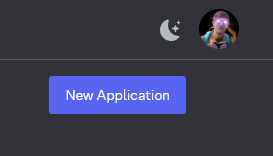
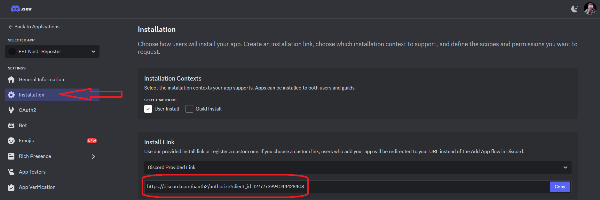
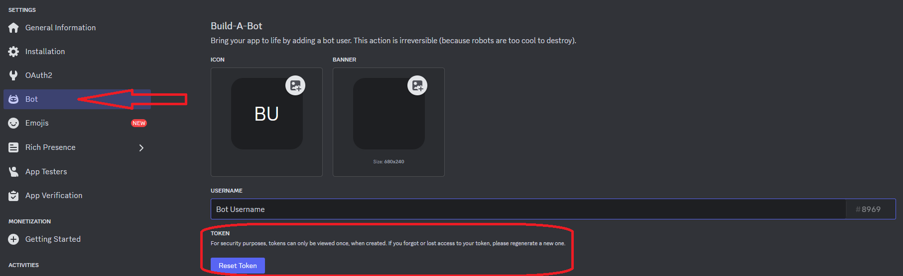
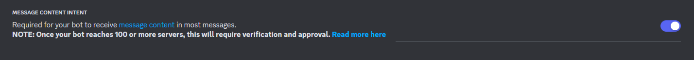
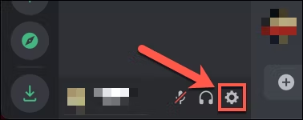
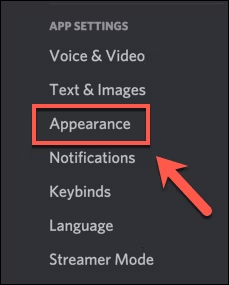
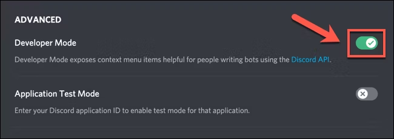
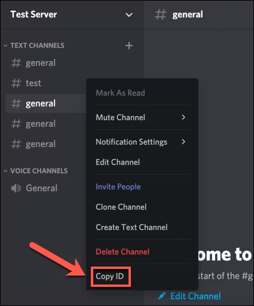

# ndmBridge

**nostr discord message Bridge**  
This program utilizes a Discord Bot to watch any Discord Channel for messages and generate a kind1 note with the same content and send that Event to a relay.

The config allows you to specify the discord channel to watch and the nostr account to sign the event with.

To get started, copy the example config:

    ```
    cp config.example.yml config.yml
    ```

Next we have to setup a Discord Bot.  
Create a discord bot in the [Discord Developer Portal](https://discord.com/developers/applications)

After loggin in, click `New Application` in the top right.  
  
Use the Discord Provided link to add the bot to your server  
  
Get the bots token from the bot page  
  
On the same page, Enable Message Content Intent  
  
Now your Discord Bot is setup but you need the channel ID of the Channel you want to repost messages from.  
For this you have to enable developer mode on discord.  
To start, open Discord and sign in. Once you're signed in, select the settings icon in the bottom-left corner next to your username.  
  
In Discord's settings menu, select the "Appearance" option in the menu on the left.  
  
In the "Appearance" menu, you'll see settings that impact how Discord appears to you, with theme options, message sizes, and accessibility settings.

Scroll down to the bottom, then select the slider next to the "Developer Mode" option. If the slider is green with a checkmark, developer mode is enabled. If it's gray with an "X" symbol, developer mode is disabled.  
  
With developer mode active, you can copy ID values for users, channels, and servers by right-clicking the server name, channel name, or username and selecting the "Copy ID" option.  


Great! Now we have the channel ID.

All that's left is to configure your nostr information.
You can use [this tool](https://nostrcheck.me/converter) to convert you npub and nsec to the correct hex format

Then set the relay you would like to broadcast the EVENT to.

After everything is configured run the program with go from the root of this project

    ```
    go run ./
    ```

That's it! Your bot will now repost any messages in that channel to the configured nostr account.
